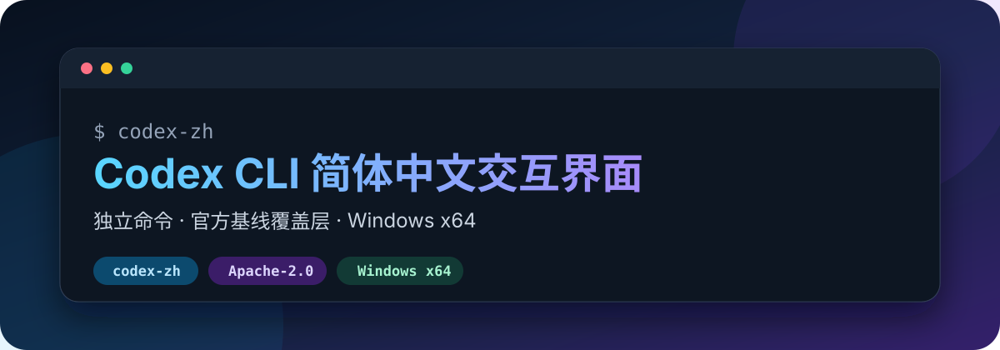

<p align="center">
  
</p>

<p align="center">
  <a href="https://github.com/sstxww/codex-cli-zh-cn/actions/workflows/build-windows-release.yml"></a>
  <a href="https://github.com/sstxww/codex-cli-zh-cn/actions/workflows/build-windows-release.yml"></a>
  
  
  <a href="LICENSE"></a>
</p>

<p align="center">
  <a href="https://github.com/sstxww/codex-cli-zh-cn/releases/latest">下载</a> ·
  <a href="README.md">English</a> ·
  <a href="https://github.com/openai/codex">官方 Codex</a> ·
  <a href="https://github.com/sstxww/codex-cli-zh-cn/actions/workflows/build-windows-release.yml">构建状态</a>
</p>

# Codex CLI 简体中文交互界面

[English](README.md)

这是 OpenAI Codex CLI 的非官方简体中文交互终端界面。它使用独立命令 `codex-zh`，不会替换官方 `codex`。

兼容基线：官方标签 `rust-v0.150.0-alpha.8`，对应 `codex-cli 0.150.0-alpha.8`。

## 一眼看懂

| 项目 | 说明 |
| --- | --- |
| 这是什么 | OpenAI Codex CLI 的非官方简体中文交互终端界面 |
| 启动命令 | `codex-zh`；与官方 `codex` 并存，不覆盖官方命令 |
| 兼容基线 | 官方 `rust-v0.150.0-alpha.8` / `codex-cli 0.150.0-alpha.8` |
| 交付形式 | 可直接运行的 Windows x64 发布包，以及便于审查的源码覆盖层 |
| 汉化边界 | 只汉化交互界面；命令、路径、ID、模型输出和原始工具输出保持不变 |

> [!IMPORTANT]
> 这是社区汉化版本，不是 OpenAI 官方发行版。请保留官方 `codex`，`codex-zh` 是独立入口。

## 最快体验

1. 从[最新 Release](https://github.com/sstxww/codex-cli-zh-cn/releases/latest)下载 `codex-cli-zh-cn-windows-x64.zip`。
2. 解压到独立目录。
3. 运行 `codex-zh.exe`；也可以使用仓库内脚本加入 `PATH`：

```powershell
.\overlay\localization\install-windows.ps1 -AddToPath
```

## 汉化范围

- 汉化交互式 TUI、首次引导、选择器、设置、状态页和常见提示。
- 命令名、参数、路径、ID、模型输出和原始工具输出保持不变。
- `codex-zh` 提供交互入口以及 `resume`、`fork`。
- 管理类和非交互式命令继续使用官方 `codex`。

## 仓库结构

`overlay/` 保存了相对兼容基线发生变化的全部源码文件。没有改动的官方文件不重复收录，便于直接审查汉化范围。源码构建时，把覆盖层复制到相同官方标签的全新检出中即可。

## Windows x64 安装

从 [Releases](https://github.com/sstxww/codex-cli-zh-cn/releases/latest) 下载 `codex-cli-zh-cn-windows-x64.zip`，解压到独立目录后运行 `codex-zh.exe`。请保留官方 Codex CLI。

仓库也提供安装脚本：

```powershell
.\overlay\localization\install-windows.ps1 -AddToPath
```

如果脚本修改了 `PATH`，请新开一个终端再运行 `codex-zh`。

## 从源码构建

```powershell
git clone https://github.com/openai/codex.git
Set-Location codex
git checkout rust-v0.150.0-alpha.8
Copy-Item -Path <汉化仓库目录>\overlay\* -Destination . -Recurse -Force
Set-Location codex-rs
cargo build --release -p codex-tui --bin codex-zh
```

## 验证结果

Windows x64 发布版已通过格式检查、TUI 定向检查、锁定依赖检查、真实终端登录界面冒烟测试、打包测试和隔离安装测试。汉化源码与未修改的官方基线运行全量测试时结果完全一致：3,754 个通过、30 个失败、10 个跳过。因此这 30 个失败属于官方源码在当前 Windows 环境中的既有基线问题，不是汉化引入的回归。

发布压缩包中只有 `codex-zh.exe`、`codex-zh.cmd` 和 `README.txt`，不含认证、配置或会话数据。公开构建前已重映射本机编译路径。社区版二进制没有代码签名，Windows 可能显示信任提示。

## 来源与许可

原始汉化工作来自 [LH-03/codex-cli-zh-cn](https://github.com/LH-03/codex-cli-zh-cn)，Codex 官方源码来自 [openai/codex](https://github.com/openai/codex)。本仓库遵循随附的 Apache-2.0 许可与声明。
